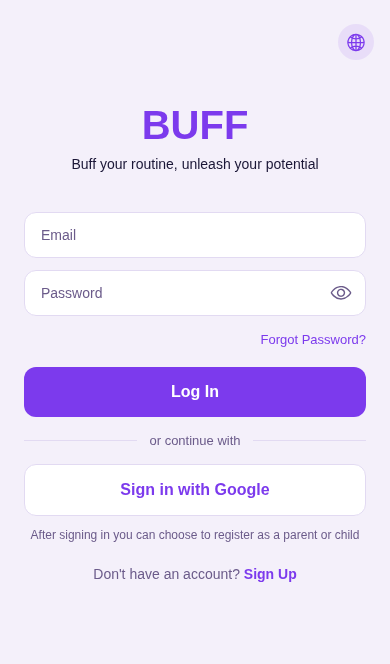
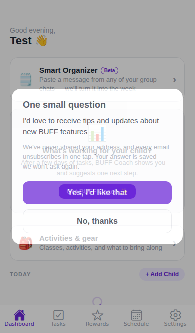
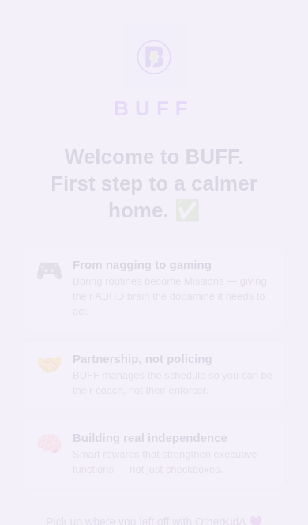
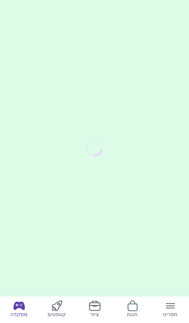
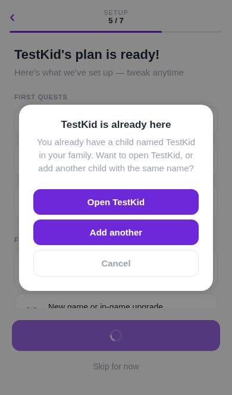
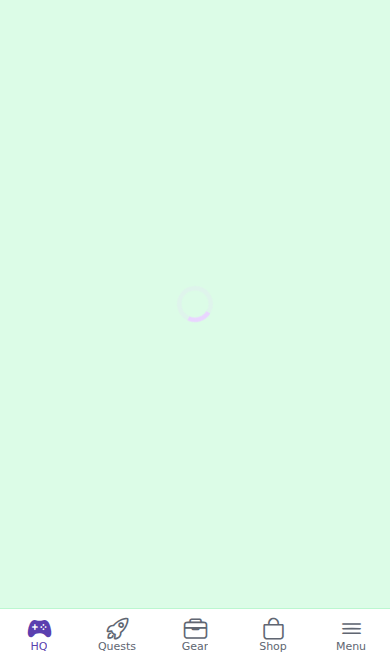

# Auth / onboarding / child-join E2E — 2026-09-24

**Result:** `main` before this pass **84/126** (7 flows broken) → `main` after the 7 PRs **138/138** (23 flows × 3 viewports × EN/HE). 3 bugs + 4 UX issues found and fixed (#481–#483, #485–#488).

**Why:** in 24h three bugs shipped on critical paths (#475 web login → onboarding, #478 step-4 Continue off-screen on mobile web, #479 Signup no-op with a session). This pass tests the **full** flows systematically.

**Method**
- **Web (driven):** `npx expo export -p web` of the code under test, served locally with SPA fallback, driven by Playwright/Chromium (`e2e/web-smoke/`), Supabase mocked at the network boundary (stateful in-memory GoTrue + PostgREST + RPCs). Matrix: 3 viewports (360×560 touch, 390×664 touch, 1280×800) × EN/HE(RTL) × session state (signed out / parent signed in / child signed in).
- **Static:** `src/navigation/__tests__/navigateTargetsRegistered.test.ts` parses the 5 RootNavigator branches and checks every navigate/replace/reset target of every auth + onboarding screen, in every branch that registers it.
- **Backend:** Supabase MCP, read-only (function definitions, counts, auth logs). No production writes.
- **Not possible here:** Android (no emulator/adb in the cloud sandbox) and the real backend (egress to `*.supabase.co`, buffadhd.com, vercel.app blocked) → §5 device checklist for Adi.

## 1. Results matrix

Run on a local web build of `origin/main` + #481–#483 + #485–#488 (= `main` at #488). Viewports: `m360` 360×560, `m390` 390×664 (touch), `desk` 1280×800. Flow ids → `e2e/web-smoke/README.md`.

| flow | m360/en | m360/he | m390/en | m390/he | desk/en | desk/he |
|---|:-:|:-:|:-:|:-:|:-:|:-:|
| A1_signup_signedOut | ✅ | ✅ | ✅ | ✅ | ✅ | ✅ |
| A2_signup_withParentSession | ✅ | ✅ | ✅ | ✅ | ✅ | ✅ |
| A3_grownUpSignIn_fromChildSession | ✅ | ✅ | ✅ | ✅ | ✅ | ✅ |
| A4_google_button | ✅ | ✅ | ✅ | ✅ | ✅ | ✅ |
| A5_google_callback_newUser | ✅ | ✅ | ✅ | ✅ | ✅ | ✅ |
| A8_google_familyCodeExit | ✅ | ✅ | ✅ | ✅ | ✅ | ✅ |
| A9_google_differentAccountExit | ✅ | ✅ | ✅ | ✅ | ✅ | ✅ |
| A6_restart_sameChildName_duplicate | ✅ | ✅ | ✅ | ✅ | ✅ | ✅ |
| A7_signup_afterOtherParentMidOnboarding | ✅ | ✅ | ✅ | ✅ | ✅ | ✅ |
| B1_login_onboarded | ✅ | ✅ | ✅ | ✅ | ✅ | ✅ |
| B2_login_midOnboarding_resume | ✅ | ✅ | ✅ | ✅ | ✅ | ✅ |
| B3_login_legacyParent | ✅ | ✅ | ✅ | ✅ | ✅ | ✅ |
| B4_wrongPassword | ✅ | ✅ | ✅ | ✅ | ✅ | ✅ |
| B5_logout_login | ✅ | ✅ | ✅ | ✅ | ✅ | ✅ |
| C1_joinLink_unlinkedChild | ✅ | ✅ | ✅ | ✅ | ✅ | ✅ |
| C2_roleSelection_childJoin_linked | ✅ | ✅ | ✅ | ✅ | ✅ | ✅ |
| C3_wrongFamilyCode | ✅ | ✅ | ✅ | ✅ | ✅ | ✅ |
| C4_teenSignup_username | ✅ | ✅ | ✅ | ✅ | ✅ | ✅ |
| C5_join_sharedDevice_parentSignedIn | ✅ | ✅ | ✅ | ✅ | ✅ | ✅ |
| C6_welcome_childJoin_midOnboarding | ✅ | ✅ | ✅ | ✅ | ✅ | ✅ |
| D1_reload_midOnboarding | ✅ | ✅ | ✅ | ✅ | ✅ | ✅ |
| D2_deepLinks_signedOut | ✅ | ✅ | ✅ | ✅ | ✅ | ✅ |
| D3_deepLinks_parentSignedIn | ✅ | ✅ | ✅ | ✅ | ✅ | ✅ |

**CTAs that start below the fold (reachable by scrolling — informational):**

- `rolesel-login`: m360/en, m360/he, m390/en, m390/he
- `access-last-option`: m360/en
- `signup-google`: m360/en, m360/he
- `teen-create`: m360/en, m360/he
- `welcome-child-join`: m360/en, m360/he, m390/en, m390/he

_138/138 cases passed · 990 checks · unmocked calls seen: table notifications, table buddy_relationships, table child_vibes, table stickers, rpc child_task_streak, table activities, table timetables, rpc get_or_create_referral_code, table referrals, rpc get_smart_insight_state, table smart_insight_feedback, table child_insights_

The remaining below-fold notes are scroll content by design (Signup/teen forms, the quiet "child join" link on Welcome, the third ChildAccess option) — all reachable, none a primary action on a fixed screen.

### 1b. Same suite on `origin/main` before the fixes (83d293b + #480)

A3 was then the old "RoleSelection reachable with a child signed in" check; A8/A9 did not exist.

| flow | m360/en | m360/he | m390/en | m390/he | desk/en | desk/he |
|---|:-:|:-:|:-:|:-:|:-:|:-:|
| A1_signup_signedOut | ✅ | ✅ | ✅ | ✅ | ✅ | ✅ |
| A2_signup_withParentSession | ✅ | ✅ | ✅ | ✅ | ✅ | ✅ |
| A3_signup_withChildSession | ❌ | ❌ | ❌ | ❌ | ❌ | ❌ |
| A4_google_button | ✅ | ✅ | ✅ | ✅ | ✅ | ✅ |
| A5_google_callback_newUser | ✅ | ✅ | ✅ | ✅ | ✅ | ✅ |
| A6_restart_sameChildName_duplicate | ❌ | ❌ | ❌ | ❌ | ❌ | ❌ |
| A7_signup_afterOtherParentMidOnboarding | ❌ | ❌ | ❌ | ❌ | ❌ | ❌ |
| B1_login_onboarded | ❌ | ❌ | ❌ | ❌ | ❌ | ❌ |
| B2_login_midOnboarding_resume | ❌ | ❌ | ❌ | ❌ | ❌ | ❌ |
| B3_login_legacyParent | ❌ | ❌ | ❌ | ❌ | ❌ | ❌ |
| B4_wrongPassword | ✅ | ✅ | ✅ | ✅ | ✅ | ✅ |
| B5_logout_login | ❌ | ❌ | ❌ | ❌ | ❌ | ❌ |
| C1_joinLink_unlinkedChild | ✅ | ✅ | ✅ | ✅ | ✅ | ✅ |
| C2_roleSelection_childJoin_linked | ✅ | ✅ | ✅ | ✅ | ✅ | ✅ |
| C3_wrongFamilyCode | ✅ | ✅ | ✅ | ✅ | ✅ | ✅ |
| C4_teenSignup_username | ✅ | ✅ | ✅ | ✅ | ✅ | ✅ |
| C5_join_sharedDevice_parentSignedIn | ✅ | ✅ | ✅ | ✅ | ✅ | ✅ |
| C6_welcome_childJoin_midOnboarding | ✅ | ✅ | ✅ | ✅ | ✅ | ✅ |
| D1_reload_midOnboarding | ✅ | ✅ | ✅ | ✅ | ✅ | ✅ |
| D2_deepLinks_signedOut | ✅ | ✅ | ✅ | ✅ | ✅ | ✅ |
| D3_deepLinks_parentSignedIn | ✅ | ✅ | ✅ | ✅ | ✅ | ✅ |

**Failures (first failed check, screenshot):**

- A3_signup_withChildSession m360/en — RoleSelection reachable while a CHILD is signed in: locator.waitFor: Timeout 20000ms exceeded.
- A3_signup_withChildSession m360/he — RoleSelection reachable while a CHILD is signed in: locator.waitFor: Timeout 20000ms exceeded.
- A3_signup_withChildSession m390/en — RoleSelection reachable while a CHILD is signed in: locator.waitFor: Timeout 20000ms exceeded.
- A3_signup_withChildSession m390/he — RoleSelection reachable while a CHILD is signed in: locator.waitFor: Timeout 20000ms exceeded.
- A3_signup_withChildSession desk/en — RoleSelection reachable while a CHILD is signed in: locator.waitFor: Timeout 20000ms exceeded.
- A3_signup_withChildSession desk/he — RoleSelection reachable while a CHILD is signed in: locator.waitFor: Timeout 20000ms exceeded.
- A6_restart_sameChildName_duplicate m360/en — "Open TestKid" closes the dialog and keeps the wizard going: locator.waitFor: Timeout 8000ms exceeded.
- A6_restart_sameChildName_duplicate m360/he — "Open TestKid" closes the dialog and keeps the wizard going: locator.waitFor: Timeout 8000ms exceeded.
- A6_restart_sameChildName_duplicate m390/en — "Open TestKid" closes the dialog and keeps the wizard going: locator.waitFor: Timeout 8000ms exceeded.
- A6_restart_sameChildName_duplicate m390/he — "Open TestKid" closes the dialog and keeps the wizard going: locator.waitFor: Timeout 8000ms exceeded.
- A6_restart_sameChildName_duplicate desk/en — "Open TestKid" closes the dialog and keeps the wizard going: locator.waitFor: Timeout 8000ms exceeded.
- A6_restart_sameChildName_duplicate desk/he — "Open TestKid" closes the dialog and keeps the wizard going: locator.waitFor: Timeout 8000ms exceeded.
- A7_signup_afterOtherParentMidOnboarding m360/en — B is not offered parent A's unfinished flow: resume offered: "Pick up where you left off with OtherKidA 💜"
- A7_signup_afterOtherParentMidOnboarding m360/he — B is not offered parent A's unfinished flow: resume offered: "נמשיך מאיפה שהפסקת עם OtherKidA 💜"
- A7_signup_afterOtherParentMidOnboarding m390/en — B is not offered parent A's unfinished flow: resume offered: "Pick up where you left off with OtherKidA 💜"
- A7_signup_afterOtherParentMidOnboarding m390/he — B is not offered parent A's unfinished flow: resume offered: "נמשיך מאיפה שהפסקת עם OtherKidA 💜"
- A7_signup_afterOtherParentMidOnboarding desk/en — B is not offered parent A's unfinished flow: resume offered: "Pick up where you left off with OtherKidA 💜"
- A7_signup_afterOtherParentMidOnboarding desk/he — B is not offered parent A's unfinished flow: resume offered: "נמשיך מאיפה שהפסקת עם OtherKidA 💜"
- B1_login_onboarded m360/en — onboarded parent → ParentApp (not onboarding): locator.waitFor: Timeout 15000ms exceeded.
- B1_login_onboarded m360/he — onboarded parent → ParentApp (not onboarding): locator.waitFor: Timeout 15000ms exceeded.
- B1_login_onboarded m390/en — onboarded parent → ParentApp (not onboarding): locator.waitFor: Timeout 15000ms exceeded.
- B1_login_onboarded m390/he — onboarded parent → ParentApp (not onboarding): locator.waitFor: Timeout 15000ms exceeded.
- B1_login_onboarded desk/en — onboarded parent → ParentApp (not onboarding): locator.waitFor: Timeout 15000ms exceeded.
- B1_login_onboarded desk/he — onboarded parent → ParentApp (not onboarding): locator.waitFor: Timeout 15000ms exceeded.
- B2_login_midOnboarding_resume m360/en — mid-onboarding parent → Welcome with resume offer: locator.waitFor: Timeout 20000ms exceeded.
- B2_login_midOnboarding_resume m360/he — mid-onboarding parent → Welcome with resume offer: locator.waitFor: Timeout 20000ms exceeded.
- B2_login_midOnboarding_resume m390/en — mid-onboarding parent → Welcome with resume offer: locator.waitFor: Timeout 20000ms exceeded.
- B2_login_midOnboarding_resume m390/he — mid-onboarding parent → Welcome with resume offer: locator.waitFor: Timeout 20000ms exceeded.
- B2_login_midOnboarding_resume desk/en — mid-onboarding parent → Welcome with resume offer: locator.waitFor: Timeout 20000ms exceeded.
- B2_login_midOnboarding_resume desk/he — mid-onboarding parent → Welcome with resume offer: locator.waitFor: Timeout 20000ms exceeded.
- B3_login_legacyParent m360/en — legacy parent → Welcome (documented gap, not ParentApp): locator.waitFor: Timeout 20000ms exceeded.
- B3_login_legacyParent m360/he — legacy parent → Welcome (documented gap, not ParentApp): locator.waitFor: Timeout 20000ms exceeded.
- B3_login_legacyParent m390/en — legacy parent → Welcome (documented gap, not ParentApp): locator.waitFor: Timeout 20000ms exceeded.
- B3_login_legacyParent m390/he — legacy parent → Welcome (documented gap, not ParentApp): locator.waitFor: Timeout 20000ms exceeded.
- B3_login_legacyParent desk/en — legacy parent → Welcome (documented gap, not ParentApp): locator.waitFor: Timeout 20000ms exceeded.
- B3_login_legacyParent desk/he — legacy parent → Welcome (documented gap, not ParentApp): locator.waitFor: Timeout 20000ms exceeded.
- B5_logout_login m360/en — re-login → ParentApp: locator.waitFor: Timeout 15000ms exceeded.
- B5_logout_login m360/he — re-login → ParentApp: locator.waitFor: Timeout 15000ms exceeded.
- B5_logout_login m390/en — re-login → ParentApp: locator.waitFor: Timeout 15000ms exceeded.
- B5_logout_login m390/he — re-login → ParentApp: locator.waitFor: Timeout 15000ms exceeded.
- B5_logout_login desk/en — re-login → ParentApp: locator.waitFor: Timeout 15000ms exceeded.
- B5_logout_login desk/he — re-login → ParentApp: locator.waitFor: Timeout 15000ms exceeded.

**CTAs that start below the fold (reachable by scrolling — informational):**

- `rolesel-login`: m360/en, m360/he
- `welcome`: m360/en, m360/he, m390/en, m390/he
- `access-last-option`: m360/en
- `step8-dashboard`: m360/en, m360/he
- `signup-google`: m360/en, m360/he
- `teen-create`: m360/en, m360/he
- `welcome-child-join`: m360/en, m360/he, m390/en, m390/he

_84/126 cases passed · 858 checks · unmocked calls seen: table notifications, table buddy_relationships, table child_vibes, table stickers, rpc child_task_streak, table activities, table timetables, rpc get_or_create_referral_code, table referrals, rpc get_smart_insight_state, table smart_insight_feedback, table child_insights_

### Screenshots

| before (origin/main) | after |
|---|---|
|  B1: logged in, still on Login |  A1: signup → onboarding → dashboard |
|  A7: "Pick up where you left off with OtherKidA" shown to another parent |  A3 (HE): grown-up sign-in → hand back → child app |
|  A6: duplicate dialog "Open" does nothing |  A8: Google picker → family code → child app |

## 2. Bugs found → PRs (all three merged by Adi 2026-09-24)

| # | bug | severity | evidence | PR |
|---|-----|----------|----------|----|
| 1 | **Web login leaves the parent on an empty Login form.** Successful email/password login (from `/Login` or RoleSelection → "Already have an account"): session saved, no ParentApp. Cause: #475/#479 registered Login in the parent branches; the post-sign-in container remount re-resolves `window.location` = `/Login` inside that branch. | **critical** (returning-parent path) | smoke B1 ❌ on `origin/main` (all 6 combos), ✅ with fix; screenshot `B1_login_onboarded-m390-en-FAIL-*.png` | [#481](https://github.com/adielgarat-pm/buff-mobile/pull/481) |
| 2 | **Duplicate-child dialog is dead mid-onboarding.** Parent in the first-run wizard types an existing child's name → "Open"/"Cancel" navigate to `ParentApp`, not registered in branch 5 → silent no-op, Continue re-prompts forever; only "Add another" works and it creates a duplicate child. | medium (latent: 0 prod parents in that state today, reachable after drop-off between step 5 and 8 + >6h) | smoke A6 ❌ main / ✅ fix; static test `navigateTargetsRegistered.test.ts` flags `UStep5_Preview→ParentApp@5` | [#482](https://github.com/adielgarat-pm/buff-mobile/pull/482) |
| 3 | **Another family's onboarding offered to a new parent (privacy).** Resume snapshot is per device, not per account; parent B signing up on a browser where parent A stopped mid-wizard sees "Pick up where you left off with *<A's child>*" and can resume A's params. Reachable since #479. | high (privacy, children's names) | smoke A7 ❌ main and ❌ #481+#482 build / ✅ with fix | [#483](https://github.com/adielgarat-pm/buff-mobile/pull/483) |

§1 ran on a local build of `origin/main` + all 7 PRs — the code `main` has now. §1b is the same suite on `origin/main` *before* any fix (83d293b + #480).

## 3. UX follow-ups (UX-expert review → approved by Adi → PRs, all merged 2026-09-24)

| # | finding | PR |
|---|---------|----|
| 4 | **Child signed in → a parent can't get in (A3).** Child UI has no logout by design; the child branch registered no auth screens. → Child Settings "Grown-up sign-in" (child session replaced only when the parent's login succeeds) + parent Settings "Hand back to {name}" (ChildJoin pre-filled, straight to the card picker). | [#486](https://github.com/adielgarat-pm/buff-mobile/pull/486) |
| 5 | **Google role picker had no way out; "Teen" created a child with no family.** → "I'm a parent" / "I have a family code" / "Not you? Use a different account ({email})"; Teen removed. | [#485](https://github.com/adielgarat-pm/buff-mobile/pull/485) |
| 6 | **Welcome "Let's start" below the fold** at 390×664 and 360×560 — first screen after signup. → pinned footer like steps 1–5. | [#487](https://github.com/adielgarat-pm/buff-mobile/pull/487) |
| 7 | **RoleSelection had no ScrollView** — at 360×560 the returning-parent login button overflowed; on native it is clipped and unreachable (web survived only because the page scrolled). **Complete "Go to Dashboard"** below the fold at 360×560. → ScrollView + compact rhythm < 640px; pinned Complete CTA. | [#488](https://github.com/adielgarat-pm/buff-mobile/pull/488) |

**Still open (not fixed, flagged):**
- **Legacy parent gap (B3, known — `parentRouting.ts`).** Children but no `onboarding_complete` → Welcome. Production today: **0** such non-test parents (181 not onboarded without children, 63 onboarded; `profiles` query 2026-09-24). With #482 their way through the wizard no longer dead-ends.
- ~~**Latent spinner-forever race in AuthContext**~~ — **fixed 2026-09-25** (`pkg/auth-signed-in-loading-race`): a `SIGNED_IN` profile fetch is no longer skipped when another fetch is in flight, so its `finally` always releases the loading gate. Regression test `src/contexts/__tests__/AuthContext.loadingRace.test.tsx` (both windows: refresh before SIGNED_IN, and between SIGNED_IN and its scheduled fetch) fails on the old code. Web smoke quick pass (m390/en) 24/24.
- ~~**Onboarding reset to Welcome on web**~~ — found by Adi's manual Google run 2026-09-26 ("finished onboarding and it threw me back to the first onboarding screen"); fix on `fix/same-user-signed-in-no-remount`. A `SIGNED_IN` for the same user, relayed from another tab over supabase-js's BroadcastChannel, raised the AuthContext loading gate and (with a new token) bumped `signInSeq`; either remounted the NavigationContainer mid-wizard. Smoke D4/D5 ❌ main (8/8) / ✅ fix (8/8). See IN-2026-09-26-01.
- ChildAccessStep's last option starts below the fold at 360×560 — left as is (third of three, reachable by scroll; UX review).

## 4. Backend checks (Supabase MCP, read-only)

- `create_child_profile` (SECURITY DEFINER): duplicate check is case-insensitive + trimmed, returns `existing_child_id` — the id #482 now reuses. Derives family + role from `auth.uid()`.
- `list_family_children`, `lookup_family_by_code`, `link_child_profile`: code match is `upper(trim())`; link refuses when the auth user already has a profile (`auth_user_already_linked`) or the profile is already linked → a shared-device child pick cannot re-link the parent's profile (smoke C5 asserts the parent profile is untouched).
- No writes were made to production. Rolled-back transaction tests of RLS were **not** run this session (the mock covers the client contract; RLS for a brand-new parent is exercised in Adi's real-device pass below).
- Auth logs (last 24h): 2 password logins, 1 IP — no signal either way on bug 1 in production.

## 5. Android / real-device checklist (Adi — cloud sandbox has no emulator)

Build: any dev/preview build from `main` at or after the #488 merge (contains all 7 PRs). Test accounts (family & child names contain **Test** → excluded from research stats; delete after):

| account | used for |
|---------|----------|
| `adi.elgarat+e2e-signup@gmail.com` — family "Test Signup", child "TestKid" | new parent signup |
| `adi.elgarat+e2e-returning@gmail.com` — onboarded, child "TestKid" | returning login, logout |
| `adi.elgarat+e2e-midflow@gmail.com` — stop at Step 3 | resume |
| `adi.elgarat+e2e-otherB@gmail.com` | second parent on same device |
| teen username `testteen1` + the Test family code | teen signup |

1. **Login (bug 1, native path):** RoleSelection → "Already have an account? Log in" → returning account → lands on **ParentApp** (not Login, not Welcome). Repeat in Hebrew.
2. **Join link cold start:** with the app killed and signed out, open `https://buffadhd.com/join/<TEST CODE>` → ChildJoin pre-filled → Continue → pick TestKid → ChildApp. **Kill and relaunch → still ChildApp** (the launch link must not be re-applied after sign-in).
3. **Shared device:** signed in as the returning parent, open the join link → ChildJoin → pick TestKid → ChildApp.
4. **New parent signup:** RoleSelection → "I'm a parent" → Signup (email) → Welcome → Steps 1–5 → first task (Not right now) → child access → Complete → Dashboard. Also try the Google button (does the account chooser open and return to the app?).
5. **Resume after process kill:** new account, stop at Step 3, swipe the app away, relaunch → Welcome offers "Pick up where you left off with TestKid" → Step 3.
6. **Snapshot owner (bug 3) — phone browser (Chrome), not the app:** open buffadhd.com, sign up a new parent and stop at Step 3. Then RoleSelection → "I'm a parent" → sign up `+e2e-otherB` → Welcome must **not** mention the first parent's child.
7. **Duplicate name (bug 2):** on a mid-flow account whose child already exists, "Start fresh" → same child name → dialog → "Open TestKid" → Continue works, still one TestKid in Manage Children.
8. **Soft keyboard:** Login, Signup and ChildJoin with the keyboard open — the primary button is visible or reachable by scrolling, on the smallest phone available.
9. **Wrong password** → "Invalid email or password", button usable again.
10. **Logout → login** from Settings → ParentApp.
11. **Grown-up sign-in (#486):** sign in as TestKid via the family code → Menu tab → "Grown-up sign-in" → "Back to BUFF" (still the child) → again → parent login → ParentApp → Settings → "Hand back to TestKid" → tap the card → child app.
12. **Google picker exits (#485):** Google with an account that has no BUFF profile → "Not you? Use a different account" → RoleSelection; again → "I have a family code" → ChildJoin.
13. **Small phone (#487/#488):** RoleSelection shows "Already have an account? Log in" without clipping; Welcome and Complete keep their button on screen.

## 6. How to re-run

`e2e/web-smoke/README.md` — `npx expo export -p web --output-dir /tmp/webdist && node e2e/web-smoke/run.mjs --dist /tmp/webdist --vp m390 --lang en` (~2 min) or the full matrix (~20 min).
